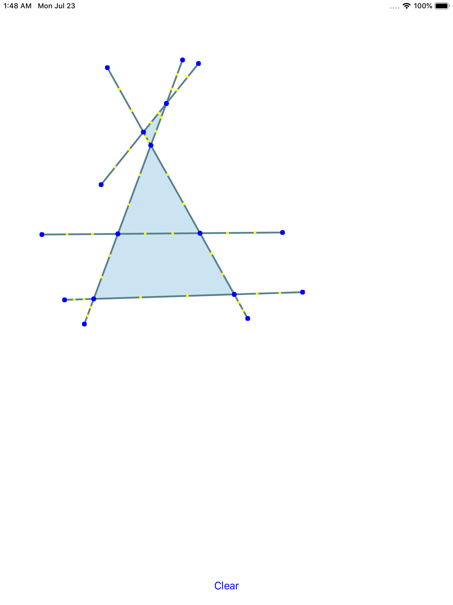
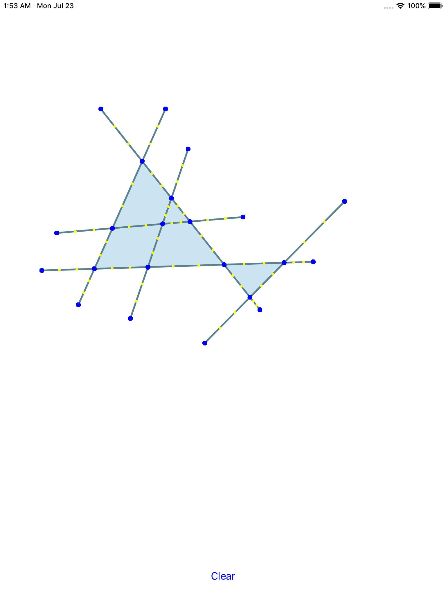
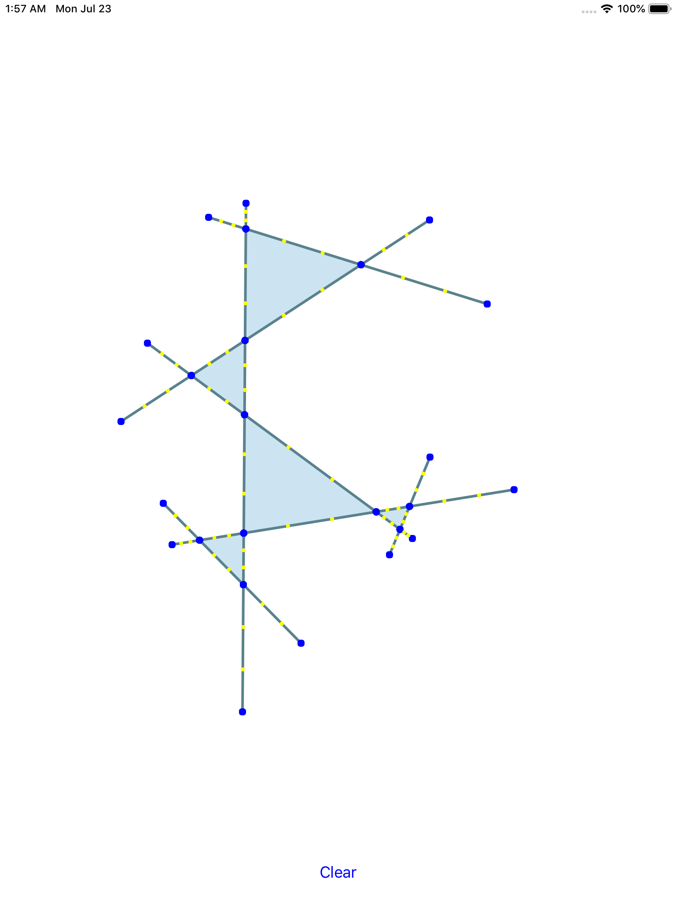
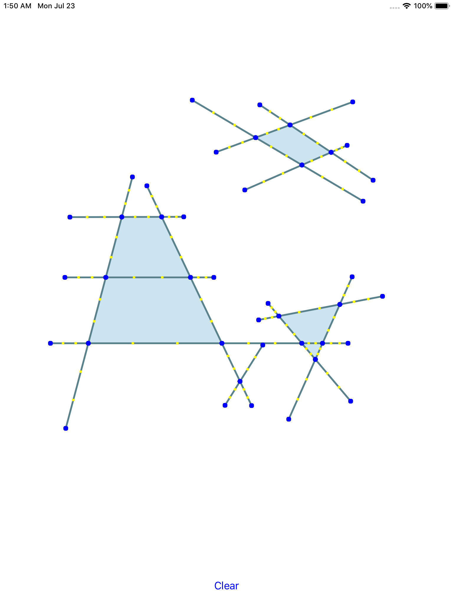
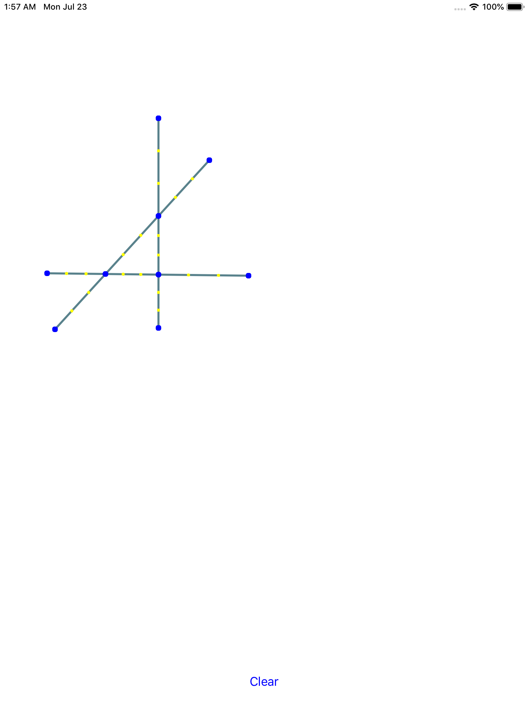
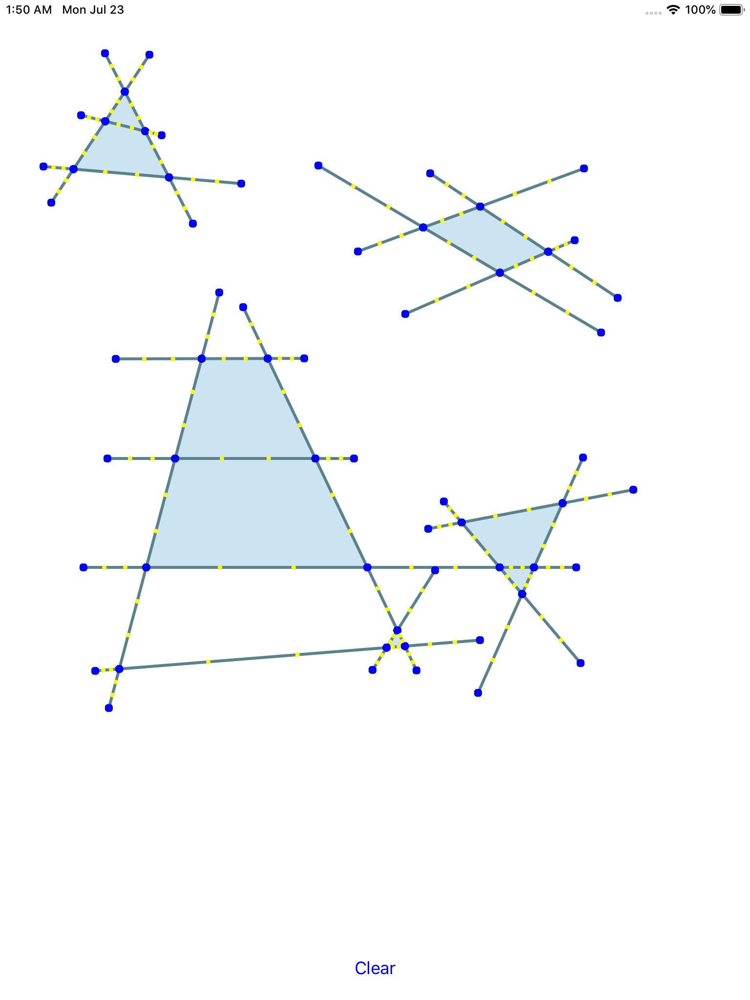

# PlanarFaceFinder

This repository attempts to implement [a planar face finder algorithm](https://math.stackexchange.com/questions/1592799/algorithm-for-enumerating-all-the-faces-of-a-multigraph-with-given-planar-embedd).

## Examples

## Known issues
- Vertical lines are not handled yet.
- The algorithm makes seemingly random mistakes.

